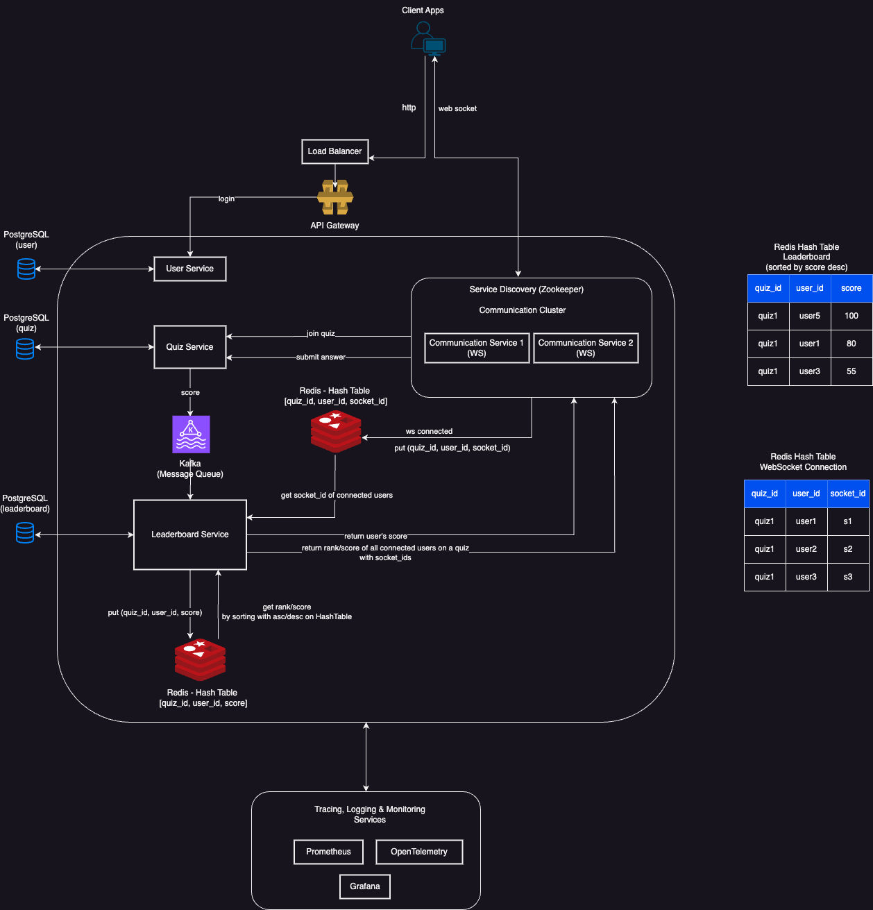

# es-challenge

## Challenge Overview

Welcome to the Real-Time Vocabulary Quiz Application! This project is designed to provide a real-time quiz feature for an English learning application. Users can answer questions in real-time, compete with others, and see their scores updated live on a leaderboard.

## System Design

- **User Participation**: Users can join a quiz session using a unique quiz ID.
- **Real-Time Score Updates**: Users' scores are updated in real-time as they submit answers.
- **Real-Time Leaderboard**: A leaderboard displays the current standings of all participants, updated promptly as scores change.

## Architecture Diagram



## Components

Client Apps (Mobile and Web Apps): These are user-facing applications where users participate in quizzes
Load Balancer: Routes incoming requests to the appropriate backend services
PostgreSQL: Relational Database, store persistent data as user, quiz, leaderboard
Zookeeper: Service Discovery, Zookeeper ensures reliable distributed system communication and service registration
Communication Service (WebSocket Server): join quiz, receive leaderboard updates, score updates in real-time
User Service: Handles authentication (login/signup) and user-related information such as profiles and permissions, using jwt
Quiz Service: Manages quiz joining, submitting answers, and calculating scores.
Kafka: Message Queue
Leaderboard Service: Updates scores and retrieves the leaderboard from Redis Hash Table, send results to Communication Service
Redis Hash Table for Leaderboard: put/get (quiz_id, user_id, score) to Redis Hash Table using sorted set to maintain quiz scores and ranks
Redis Hash Table for WebSocket Connection: Stores active WebSocket connections with put/get (quiz_id, user_id, score)
OpenTelemetry: Tracing Service, provides distributed tracing to monitor service performance and detect bottlenecks, helping diagnose performance issues
Prometheus + Grafana: Monitoring and Logging, collects metrics for real-time monitoring of system health (CPU, memory, service response times), visualizes these metrics via dashboards for easier monitoring and alerting.

### Installation

**Run Docker Compose**

```sh
docker-compose up -d
```

**Database access**
POSTGRES_HOST: localhost:5432
POSTGRES_USER: root
POSTGRES_PASSWORD: 123456
POSTGRES_DB: es_quiz

**Backend Service Swagger**
http://localhost:8000/docs#/
